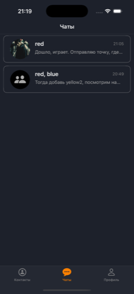
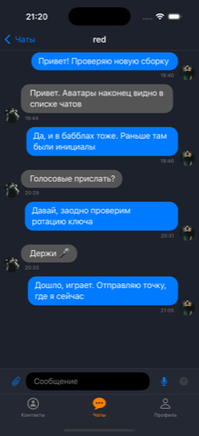
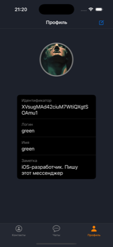

# SecretMessanger

iOS-мессенджер на Firebase, в котором сообщения запечатываются на устройстве и уходят
в базу уже шифротекстом.

UIKit, MVP, без SwiftUI. Около 8 000 строк Swift и 64 юнит-теста.

*[Read in English](README.md)*

| Чаты | Переписка | Контакты | Профиль |
|:---:|:---:|:---:|:---:|
|  |  |  |  |

<sub>Симулятор, тестовые аккаунты. У диалога на двоих в строке аватар собеседника, у
группы — значок: выбрать одно лицо из нескольких значило бы соврать.</sub>

---

## Что работает

| | |
|---|---|
| **Вход** | Почта и пароль плюс замок по Face ID / Touch ID при запуске |
| **Регистрация** | Уникальные логины — их держит реестр, а не проверка на клиенте |
| **Переписка** | Диалоги и группы: участников добавляют, удаляют, из группы выходят |
| **Шифрование** | Запечатывается на устройстве; при удалении участника ключ ротируется |
| **Вложения** | Голосовые, фото и точка на карте — всё внутри Firestore |
| **Профили** | Логин, имя, заметка и аватар; смена логина проходит через реестр |

Ещё не сделано: видео, живая геопозиция, подпись к фото, съёмка на камеру, передача прав
создателя группы и превращение диалога на двоих в группу.

## Архитектура

MVP, фабрика модулей — `Builder`. Каждый экран это тройка `View` / `Presenter` /
`Manager`: вью не знает ничего, кроме протокола своего презентера, а с Firestore говорит
только менеджер.

```
SecretMessanger/
├─ Module/
│  ├─ Authentication/   биометрия, вход, регистрация
│  └─ App/              контакты, чаты, переписка, участники, профили
├─ Helpers/
│  ├─ Crypto/           ключи, запечатывание, ключ диалога
│  ├─ Image/            аватары: хранилище, кодировщик, круглая вьюха
│  ├─ Audio/            запись и воспроизведение
│  ├─ Location/         разовый фикс с повторами
│  └─ LoginRegistry/    уникальные имена
└─ Builder/             фабрика модулей
```

Firestore вызывается из менеджеров напрямую, а не прячется за протокол транспорта. Это
осознанное решение: приложение доводится до конца на Firebase, и второй реализации, ради
которой заводят абстракцию, здесь не будет.

## Данные в Firestore

```
users/{uid}              login, name, someInfo, publicKey, avatarVersion
logins/{login}           uid                      — документ на каждое занятое имя
avatars/{uid}            data (bytes), version
conversation/{id}        users, owner, logins, lastMessage, convoKeys, keyVersion
   messages/{id}         senderId, message, type, enc, v, date
   audio/{id}            senderId, data (bytes)   — голосовые
   images/{id}           senderId, data (bytes)   — фото
```

Через эту схему проходят две мысли.

**Медиа лежит внутри документов.** Cloud Storage потребовал бы тариф Blaze, а главное —
его правила не умеют читать Firestore, и «файл видят только участники диалога» там не
выражается вовсе. Минута речи в моно-AAC — около 180 КБ, фото подгоняется под бюджет
в 700 КБ. И то и другое живёт в подколлекциях, а не в самом сообщении: чат перечитывает
последние полсотни сообщений при каждом изменении, и мегабайты ездить не могут.

**Байты отделены от их описания.** В сообщении едет длительность или размеры картинки —
этого хватает, чтобы сверстать пузырь до того, как приедут сами байты.

## Шифрование

У каждого есть постоянная пара ключей Curve25519. Приватная половина живёт в Keychain и
не покидает его никогда, открытая публикуется в профиль. Запись в Keychain
синхронизируемая, поэтому ключ доезжает до других устройств того же Apple ID через iCloud
Keychain: без этого новый телефон означал бы навсегда нечитаемую переписку.

У диалога свой симметричный ключ, и лежит он в шапке, запечатанный отдельно для каждого:

```
convoKeys: { "<uid>_<версия>": "<эфемерный открытый ключ>.<шифротекст>" }
keyVersion: <текущая версия>
```

Запечатывание идёт на одноразовой паре, так что получателю не нужно знать, кто запечатал.
Id диалога и номер версии подмешиваются в вывод HKDF — именно это не даёт переставить
запечатанный ключ в другой диалог или выдать его за другую версию; оба случая под тестами.

Удаление участника из группы заводит новую версию ключа для оставшихся. Старые версии из
шапки не убираются, иначе история стала бы нечитаемой, и каждое сообщение помнит, какой
версией закрыто.

> **Что шифрование не прячет:** `senderId`, время, состав участников, логины, аватар, сам
> факт переписки и её частоту. Firestore это видит. Закрыто содержание, а не структура, и
> делать вид, что иначе, незачем.

## Правила безопасности

`firestore.rules` лежит в репозитории и выложен. Профили читает любой вошедший — на этом
держится список контактов; диалог и его сообщения читают только участники, `senderId`
обязан совпасть с вошедшим, а править и удалять сообщения не может никто.

Правила покрыты своим набором через Rules API — в последний раз 12 случаев на одну только
коллекцию аватаров.

## Сборка

Xcode 16, iOS 17.6 и выше. Зависимости подтягиваются по SPM при первом открытии:
firebase-ios-sdk 11.7+, MessageKit 5.0+.

> **Собирать только с подписью.** С `CODE_SIGNING_ALLOWED=NO` приложение компилируется и
> запускается, но Firebase Auth падает на `An error occurred when accessing the keychain`:
> без entitlement сессию некуда положить. На экране это выглядит как кнопка «Войти»,
> которая молча ничего не делает, — знать об этом стоит до того, как потратишь полдня.

`GoogleService-Info.plist` лежит в репозитории намеренно: клиентский конфиг публичен по
своей природе, а закрывает базу не он, а правила.

## Тесты

64 теста, и ни одному из них не нужны ни сеть, ни экран:

```bash
xcodebuild test -project SecretMessanger.xcodeproj -scheme SecretMessanger \
  -destination 'platform=iOS Simulator,name=iPhone 16 Pro'
```

Покрыто то, где ошибка дорога и незаметна: крипто-примитивы (упор на отрицательные
случаи — чужим ключом ничего не открывается, запечатанный ключ не меняет диалог и
версию), кодировщики картинок с их бюджетами, правила логина, детерминированный id
диалога, полезная нагрузка геопозиции и договор документа в обе стороны — что приложение
пишет и что вычитывает обратно.

Не покрыто: всё, что реально ходит в Firestore, и экраны.
